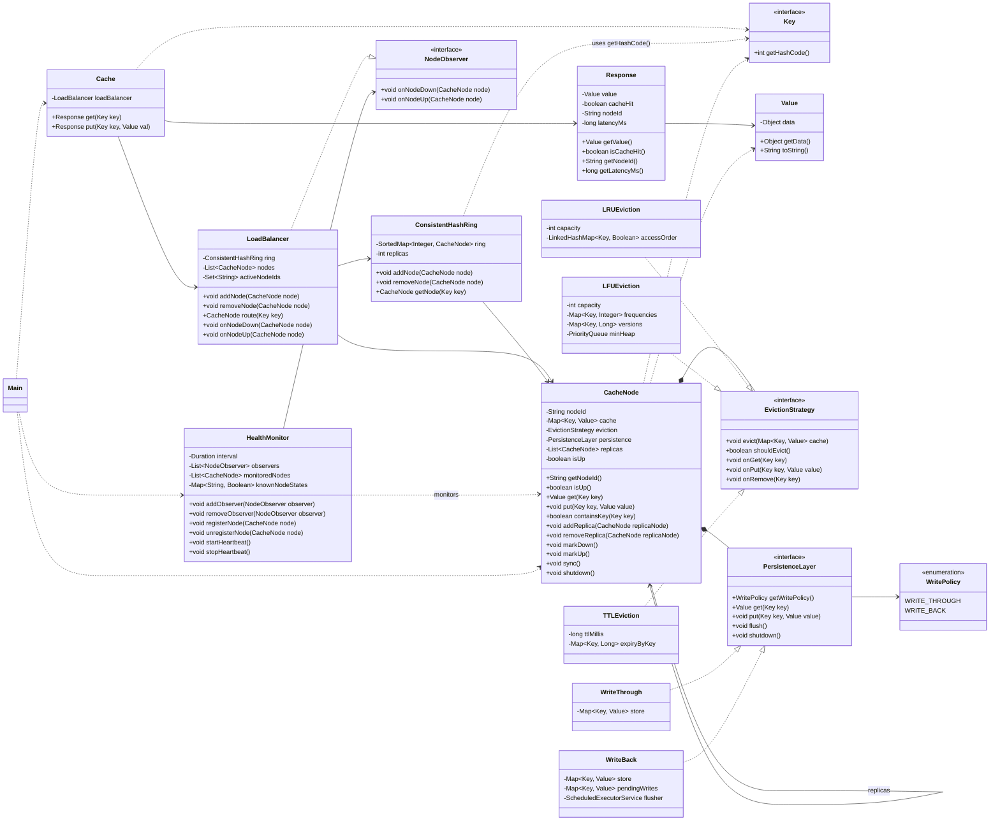

# Distributed Cache System (LLD Implementation)

This repository contains a Java low-level design implementation of a distributed cache with:

- client-facing cache API
- consistent-hash based routing
- per-node storage and replication
- pluggable eviction strategies (LRU, LFU, TTL)
- pluggable persistence policies (write-through, write-back)
- heartbeat-based health monitoring and failover support

## UML Class Diagram



## Running the Demo

From this directory:

```bash
javac *.java
java Main
```

The demo in Main exercises:

- basic put/get through Cache
- replication path (primary to replica)
- LRU eviction behavior
- node down/up detection and routing failover

## Notes

- All classes are intentionally kept in a single folder and default package, per requirement.
- This is an LLD-style implementation focused on behavior and component interaction.
